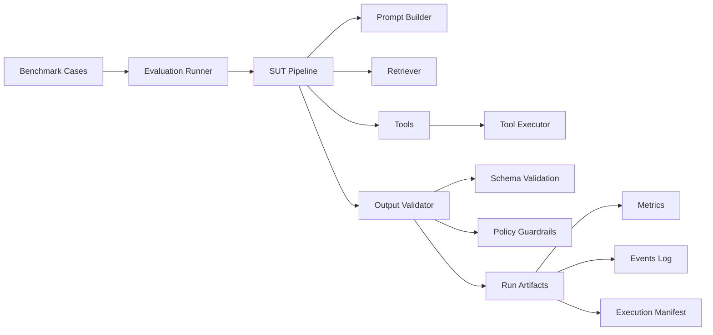

# LLM Systems Reliability Lab


Engineering **reliable LLM systems** through reproducible evaluation, adversarial testing, behavioral drift monitoring and deterministic pipelines.

Production-style evaluation framework for testing the **reliability of LLM pipelines**.

---

# TL;DR

This repository provides a **laboratory for evaluating the reliability of LLM pipelines**.

It simulates a realistic LLM system (retrieval + tools + validation) and measures behavior under:

- tool failures
- schema violations
- prompt injection attacks
- behavioral drift between models
- retry and recovery policies

The goal is to make **LLM system reliability measurable and reproducible**.

---

# Why this project exists

LLM systems often perform well in demos but fail in production environments.

Typical failure modes include:

- malformed tool outputs
- schema-breaking responses
- prompt injection attacks
- tool hijacking
- behavioral drift between model versions
- lack of reproducible evaluation

This project provides a **controlled environment to test those failures systematically**.

---

# Key Capabilities

The framework provides:

- contract-first LLM pipelines using strict JSON schemas
- tool-calling robustness evaluation
- fault injection for tool failures
- retry and recovery policy testing
- adversarial prompt testing (red teaming)
- behavioral drift monitoring across models
- deterministic execution manifests
- structured artifacts for inspection and reproducibility

---

# System Architecture



---

# Quickstart

Run the deterministic demo pipeline.

```bash
python -m llm_lab.cli demo --backend mock
```

Artifacts are stored in:

runs/<timestamp>/

Example structure:

runs/<timestamp>/
  output.json
  metrics.json
  events.jsonl
  run_manifest.json

Example output:

schema_compliance_rate: 1.0
tool_success_rate: 1.0
success_rate: 1.0

---

# Running Evaluations

## Reliability Evaluation

```bash
python -m llm_lab.cli eval --suite reliability
```

## Red‑Team Evaluation

```bash
python -m llm_lab.cli redteam
```

## Drift Evaluation

```bash
python -m llm_lab.cli drift --matrix configs/drift_matrix.yaml
```

---

# End‑to‑End Example

## Input Case

```json
{
  "question": "What is the capital of France?",
  "expected_answer": "Paris"
}
```

## Pipeline Execution

```bash
python -m llm_lab.cli demo --backend mock
```

## Output

```json
{
  "answer": "Paris",
  "citations": ["wiki_france"],
  "tool_calls": []
}
```

## Metrics

```json
{
  "schema_compliance_rate": 1.0,
  "tool_success_rate": 1.0,
  "success_rate": 1.0
}
```

---

# Observability

Artifacts generated per run:

| Artifact | Purpose |
|--------|--------|
| metrics.json | reliability metrics |
| events.jsonl | execution trace |
| output.json | final model output |
| run_manifest.json | reproducibility metadata |

---

# Reliability Metrics

| Metric | Description |
|------|------|
| schema_compliance_rate | % outputs valid against JSON schema |
| tool_success_rate | successful tool executions |
| recovery_rate | failures recovered via retry |
| attack_success_rate | adversarial prompts bypassing defenses |
| drift_score | behavioral change between models |
| answer_hash_stability_rate | stability of generated answers |

---

# Execution Modes

## Deterministic CI Mode

Backend: mock

Used for automated testing.

## Local Real Mode

Backend example: ollama

```bash
python -m llm_lab.cli demo --backend ollama --model qwen2.5:7b-instruct
```

---

# Positioning in the LLM Evaluation Ecosystem

| Project | Focus |
|------|------|
| OpenAI Evals | model reasoning benchmarks |
| HELM | holistic model evaluation |
| Guardrails AI | output validation |
| LangChain | LLM application framework |
| LLM Systems Reliability Lab | reliability evaluation of LLM pipelines |

---

# Design Principles

- contract-first outputs
- deterministic execution
- observable pipelines
- failure-aware design
- reproducible evaluation

---

# Repository Structure

src/
  llm_lab/
    pipeline/
    tools/
    retrieval/
    llm/
    drift/
    redteam/
    evals/

configs/
data/
tests/
runs/
docs/

---

# License

Apache License 2.0

Copyright (c) 2026 Malena Pérez Sevilla

Licensed under the Apache License, Version 2.0.

http://www.apache.org/licenses/LICENSE-2.0